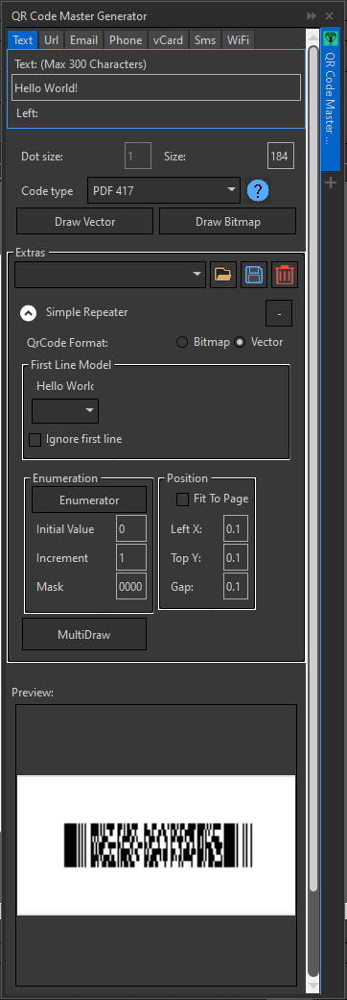
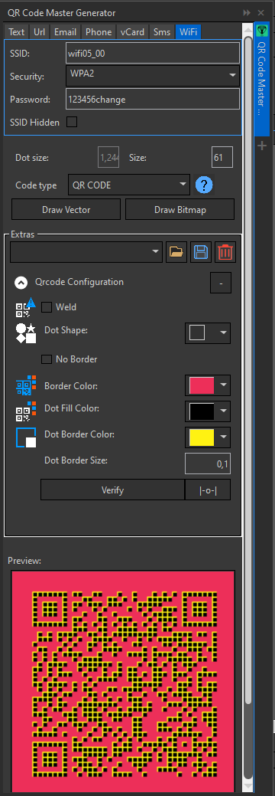
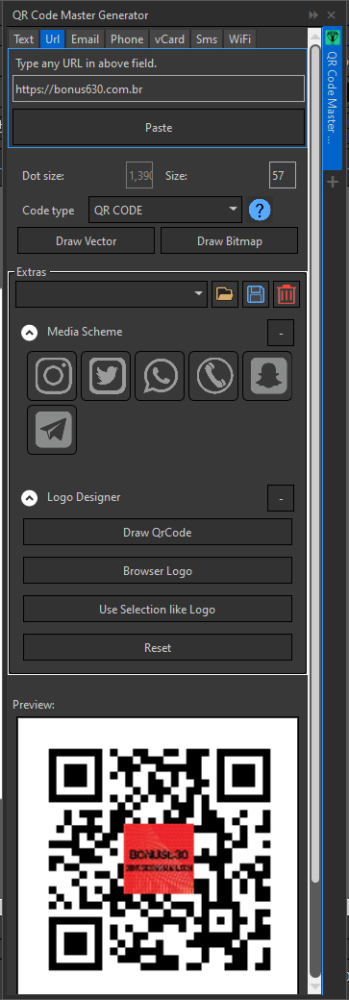

# QrCodeDocker
CorelDraw Addon X7 or Higher, provides a creation of qr codes in offline mode, in batch and customization, uses the zxing library to codify and decodify the qrcode. Dont require internet or autentication. Please see link below to features demonstration

<style type="text/css">
.tg  {border-collapse:collapse;border-spacing:0;}
.tg td{border-color:black;border-style:solid;border-width:1px;font-family:Arial, sans-serif;font-size:14px;
  overflow:hidden;padding:10px 5px;word-break:normal;}
.tg th{border-color:black;border-style:solid;border-width:1px;font-family:Arial, sans-serif;font-size:14px;
  font-weight:normal;overflow:hidden;padding:10px 5px;word-break:normal;}
.tg .tg-0pky{border-color:inherit;text-align:left;vertical-align:top}
</style>
<table class="tg">
<thead>
  <tr>
    <td class="tg-0pky"></td>
<td class="tg-0pky"></td>  
<td class="tg-0pky"></td>  </tr>
</thead>
</table>


## How add a new language
Go to folder "Lang" in any project, copy a language xml e replace language code in file name for target language.
In language xml, changes author and translate the tags values, dont change tags names.
Is required make this in all projects.
if doesnt know language code value follow to coreldraw installation folder in language folder and get the folder name, for exemple, <C:\Program Files\Corel\CorelDRAW Graphics Suite X8\Languages>

## Build Instructions

1. Open the file "bonus630.CDRCommon.targets" and change the installation path of the desired version to your installation path.

2. Locate the MSBuild.exe, usually located at `C:\Windows\Microsoft.NET\Framework64\v4.0.30319`.

3. Run the command prompt or PowerShell in the folder as an administrator.

4. Copy the path to the "QrCodeDocker.sln" file located in the project folder.

5. In PowerShell, type the command `.\msbuild.exe "<path>" /p:Configuration="<configuration>"`, replacing `<path>` with the copied path and `<configuration>` with the desired installation. The available configurations are:
   - X7 Release
   - X8 Release
   - 2017 Release
   - 2018 Release
   - 2019 Release
   - 2020 Release
   - 2021 Release
   - 2022 Release
   - 2024 Release

6. In the command prompt, remove the initial `.\` from the command.

## How to use it in your project - Hello World

Draw a simple Qrcode code contains "Hello World!"

Adds reference

- ImageRender
- QrCodeDocker

```
 var codeGen = new br.corp.bonus630.QrCodeDocker.QrCodeGenerator(CorelApplicationObject);
 var imageRender = new br.corp.bonus630.ImageRender.ZXingImageRender();
 codeGen.SetRender(imageRender);
 Corel.Interop.VGCore.Shape code = codeGen.CreateVetorLocal(CorelApplicationObject.ActiveLayer, "Hello World!", 100);
````   